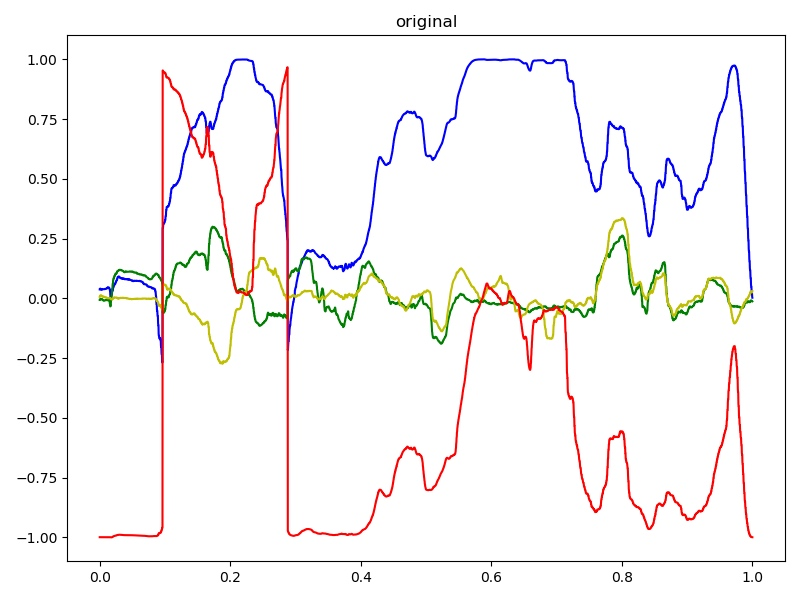

# LSTM 调优

## 数据挖掘
- 共有四个维度数据，对应的应该是Yaw pitch row 和一个其他维度
- 数据的取值范围在[-1, 1]之间
- 采样频率是30FPS

- 红色是与Yaw有关的，蓝色是与Pitch有关的。一个有趣的事情是Yaw的数据会出现大幅波动。我认为这是用户头部转过180度导致的。这个特性会影响预测。

## 建模
阅读学长的论文尝试建立LSTM模型。

- 输入数据为60个刻度
- 隐藏层为128层
- 每层之间添加了dropout
- 输出添加了一个线性层，收集各个隐藏层的输出
- 整个数据集包括了58个受试者对5个视频的观看记录

## 实验
1. 用单个记录进行学习，根据时间划分训练集/测试集，效果可以
2. 用所有记录进行学习，随机划分，则loss很高，甚至会无法学习
3. 抽出所有受试者关于视频一的记录（58条）划分测试/训练集，模型收敛
4. 抽出某受试者观看不同视频的记录（5条）划分测试/训练集，模型收敛

- 如果不加入Dropout，会导致过拟合
- 加入一个linear层可以得到更好的效果（改善很小）
- LSTM能够学习数据记录时，因头部转过180导致的Yaw值突变这一特征，我认为这是它优于线性回归模型的原因。

## 效果评判
- 根据学长论文的评价方法，预测结果是理想的（容许有一定的误差）
- 如果能对视频有针对性的训练，预测效果有提升，下图是一个泛化的模型的表现
- 这里有波动，和作图方式有关。但我们可以看到输入信号（人头部的姿态）常常会发生突变。

# Improvements
- 在未来的头部预测中，时间越靠前的预测越重要。是不是可以在loss的设计上作出优化呢？
- 是不是可以结合统计学工具，利用**多个用户**观看**同一视频**的数据，统计出视频的**热点**，从而优化视频的传输。